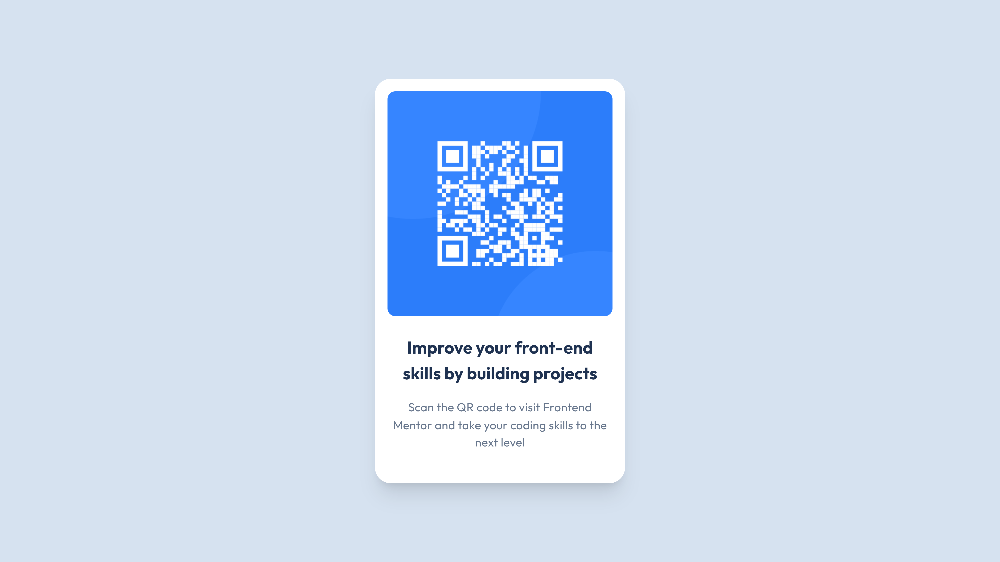

# Frontend Mentor - QR code component solution

This is a solution to the [QR code component challenge on Frontend Mentor](https://www.frontendmentor.io/challenges/qr-code-component-iux_sIO_H). Frontend Mentor challenges help you improve your coding skills by building realistic projects.

## Table of contents

- [Overview](#overview)
  - [Screenshot](#screenshot)
  - [Links](#links)
- [My process](#my-process)
  - [Built with](#built-with)
- [Author](#author)

## Overview

### Screenshot

### Links

- Live Site URL: [qr-code-component-so.vercel.app](https://qr-code-component-so.vercel.app/)

## My process

### Built with

- Semantic HTML5 markup
- [Tailwind CSS](https://tailwindcss.com/)
- Flexbox
- CSS Grid
- Mobile-first workflow
- [Vite](https://vitejs.dev/)

## Author

- Website - [Sarah Oliveira](https://saraholiveira.vercel.app)
- Frontend Mentor - [@soliveirarm](https://www.frontendmentor.io/profile/soliveirarm)
- [Github](https://github.com/soliveirarm)
- [Linkedin](https://linkedin.com/in/soliveirarm)
